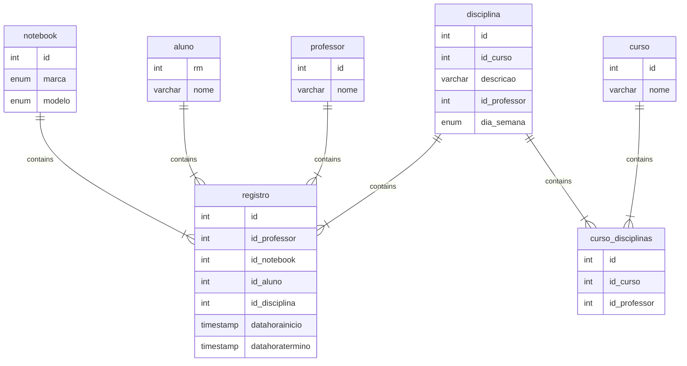

# Controle de Notebooks

Neste projeto iremos criar uma aplicação Web e uma API para o controle de uso dos notebooks da Sala Maker.

```mermaid
    erDiagram
        notebook ||--|{ registro : contains        
        aluno ||--|{ registro : contains
        professor ||--|{ registro : contains 
        disciplina ||--|{ registro : contains  
        curso ||--|{ curso_disciplinas : contains 
        disciplina ||--|{ curso_disciplinas : contains 


        aluno {
            int rm            
            varchar nome

        }
        professor {
            int id
            varchar nome
        }
        curso {
            int id
            varchar nome
        }
        disciplina {
            int id
            int id_curso
            varchar descricao
            int id_professor
            enum dia_semana
        }
        curso_disciplinas {
            int id
            int id_curso
            int id_professor
        }

        notebook {
            int id
            enum marca
            enum modelo
        }
        registro {
            int id
            int id_professor
            int id_notebook
            int id_aluno
            int id_disciplina
            timestamp datahorainicio
            timestamp datahoratermino
        }

```