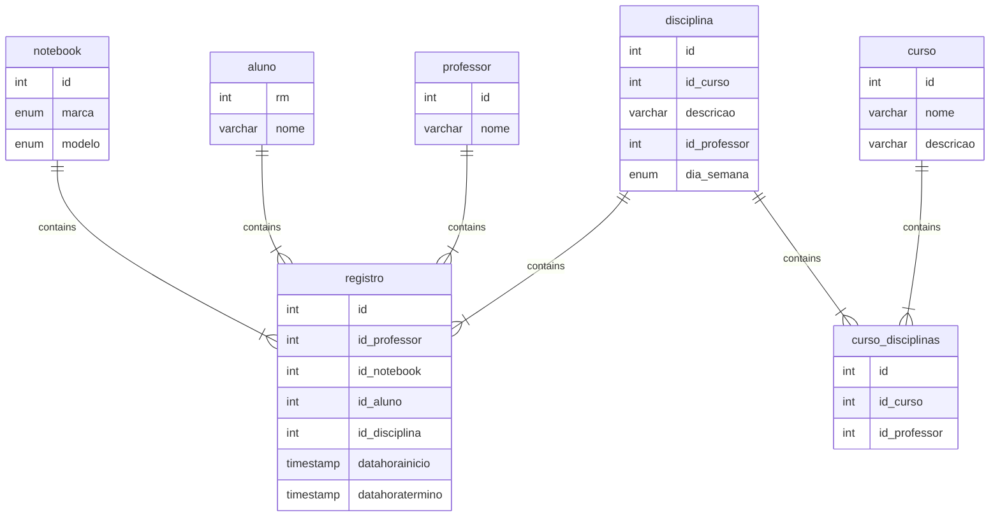

# Controle de Notebooks

Neste projeto iremos criar uma aplicação Web e uma API para o controle de uso dos notebooks da Sala Maker.

## Grupos

Num | Integrantes                       | Tema
-- |-----------------------------------| --
1 | Pedro Beck, Pedro Otavio, Giovani | Disciplina
2 | Maria Beatriz, Valdir             | Professor
3 | Tiago R, Carlos, Vitor Fellizatti | Aluno 
4 | Vinicius, Tiago Alvares, Mateus M | Notebook
5 | Guilerme, Chiara, Thiago Barros   | Locação
6 | Pablo, Kauan, Lucas Teodoro | Curso com relacionamento de disciplinas